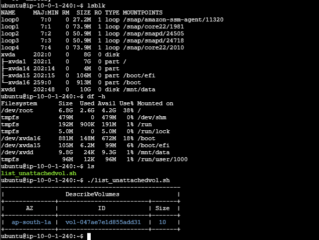

# EBS Volume Setup and Unattached Volume Detection

## Step-by-step Summary

- I created **two Elastic Block Store (EBS) volumes** of 10 GB each.
- Then, I **attached both volumes** to an EC2 instance:

  

- After connecting via SSH, I ran:
  ```bash
  lsblk
  ```
  This listed the newly created volumes:

  ```
  xvdd
  xvde
  ```

## Formatting and Mounting the First Volume

- I formatted the first volume (`xvdd`) using:
  ```bash
  sudo mkfs.ext4 /dev/xvdd
  ```

- Then mounted it using:
  ```bash
  sudo mount /dev/xvdd /mnt/data
  ```

### Make the Mount Persistent

- To make the mount persistent, I added an entry to `/etc/fstab`:
  1. First, retrieved the UUID:
     ```bash
     sudo blkid /dev/xvdd
     ```

  2. Copied the UUID.

  3. Edited the `/etc/fstab` file and added:
     ```
     UUID=abcd1234-56ef-7890-gh12-ijkl34567890 /mnt/data ext4 defaults,nofail 0 0
     ```

- For testing:
  ```bash
  sudo umount /mnt/data
  sudo mount -a
  df -h
  ```

## Detaching the Second Volume

- I then **detached the second volume** (`xvde`) in AWS.

## Bash Script to List Unattached Volumes

- I wrote a bash script to **list unattached volumes**.

### Prerequisites

- Install AWS CLI:
  ```bash
  sudo apt install awscli
  ```

- Configure AWS credentials:
  ```bash
  aws configure
  ```
  - Enter access key, secret key, region, and output format.

### Run the Script

- Make the script executable:
  ```bash
  chmod +x list_unmounvolumes.sh
  ```

- Execute the script:
  ```bash
  ./list_unmounvolumes.sh
  ```

- The output will list the **unmounted volumes**:

  
