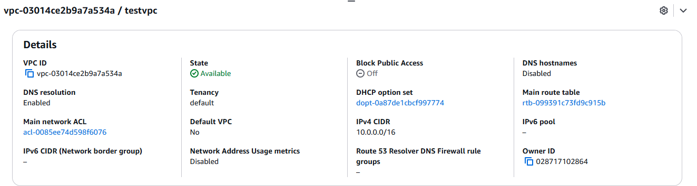
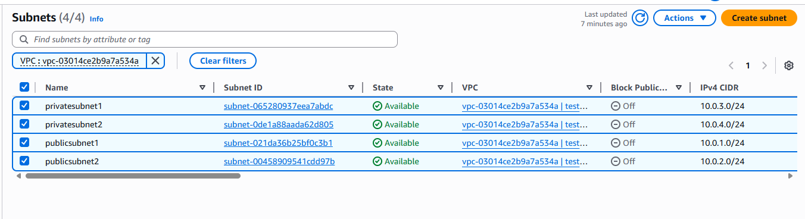
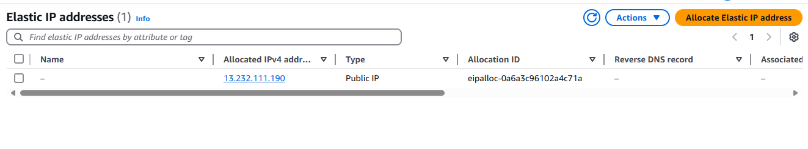
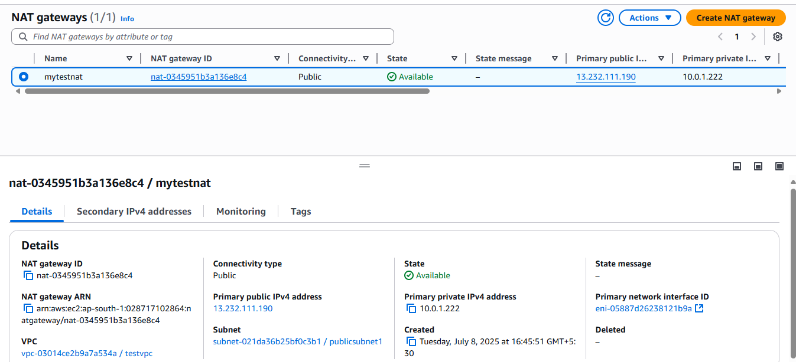
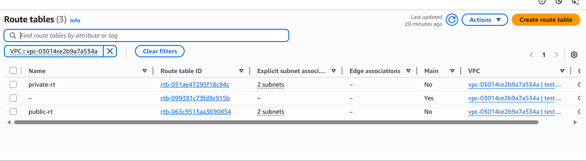

# 🛠️ AWS VPC Setup – Mumbai Region (ap-south-1)

This project demonstrates a custom AWS VPC architecture setup in the Mumbai (`ap-south-1`) region with public and private subnets, an Internet Gateway, a NAT Gateway, and route tables.

---

## 🗺️ Architecture Overview

- **VPC CIDR Block:** `10.0.0.0/16`
- **Availability Zones Used:** `ap-south-1a`, `ap-south-1b`
- **Total Subnets:** 4 (2 public + 2 private)
- **Internet Access:** Internet Gateway (for public), NAT Gateway (for private)
- **Route Tables:** 1 public + 1 private

---

## 🧭 Logical Flow Diagram (ASCII)

```text
             ┌────────────────────────────┐
             │          VPC               │
             │  (10.0.0.0/16 - ap-south-1)│
             └────────────────────────────┘
                        │
                        ▼
                ┌──────────────┐
                │ Internet     │
                │ Gateway (IGW)│
                └────┬─────────┘
                     │
        ┌────────────┴────────────┐
        │                         │
        ▼                         ▼
┌─────────────┐           ┌─────────────┐
│ Public RT   │           │ Public RT   │
│ 0.0.0.0/0 → │           │ 0.0.0.0/0 → │
│ IGW         │           │ IGW         │
└─────┬───────┘           └─────┬───────┘
      │                         │
      ▼                         ▼
┌─────────────┐          ┌──────────────┐
│ Public Sub1 │          │ Public Sub2  │
│ AZ-1a       │          │ AZ-1b        │
└─────────────┘          └──────────────┘
      │                         │
      ▼                         ▼
┌─────────────┐         ┌───────────────┐
│ NAT Gateway │         │ Elastic IP    │
│ (in PubSub1)│         └───────────────┘
└─────┬───────┘
      │
┌─────▼─────────────────────────────────┐
│       Private Route Table             │
│ 0.0.0.0/0 → NAT Gateway               │
└─────┬────────────┬────────────────────┘
      ▼            ▼
┌─────────────┐ ┌─────────────┐
│ Private Sub1│ │ Private Sub2│
│ AZ-1a       │ │ AZ-1b       │
└─────────────┘ └─────────────┘
```

---

## 🌐 VPC Configuration

- Created a VPC with CIDR block `10.0.0.0/16`
- Supports up to **65,534 usable IPs**



---

## 🧱 Subnet Design

| Subnet Type | Name             | CIDR Block     | Availability Zone |
|-------------|------------------|----------------|-------------------|
| Public      | Public Subnet 1  | `10.0.1.0/24`  | ap-south-1a       |
| Public      | Public Subnet 2  | `10.0.2.0/24`  | ap-south-1b       |
| Private     | Private Subnet 1 | `10.0.3.0/24`  | ap-south-1a       |
| Private     | Private Subnet 2 | `10.0.4.0/24`  | ap-south-1b       |



---

## 🌍 Internet Gateway

- Created and attached to the VPC to allow outbound internet traffic from public subnets.


---

## 🌐 NAT Gateway & Elastic IP

- Allocated an Elastic IP.
- Created a NAT Gateway inside **Public Subnet 1 (ap-south-1a)**.
- Used by **private subnets** to access the internet securely.




---

## 🛣️ Route Tables

### 🔹 Public Route Table

- **Destination:** `0.0.0.0/0`
- **Target:** Internet Gateway
- **Associated Subnets:** Public Subnet 1 & 2

### 🔸 Private Route Table

- **Destination:** `0.0.0.0/0`
- **Target:** NAT Gateway ✅
- **Associated Subnets:** Private Subnet 1 & 2



---

## ✅ Summary

- 🔐 Public subnets are internet-facing (via IGW)
- 🔒 Private subnets access internet via NAT
- 📈 Architecture supports high availability (spread across AZs)
- 🚀 Ready for launching EC2, RDS, or microservice apps

---

## 📎 Directory Structure

```
Learning/
└── AWS/
    ├── README.md
    └── images/
        ├── elasticip.png
        ├── internetgateway.png
        ├── nat.png
        ├── routetable.png
        ├── subnet.png
        └── vpc.png
```

---

> 🧠 Let me know if you want a Terraform script or a printable version of the architecture diagram!
