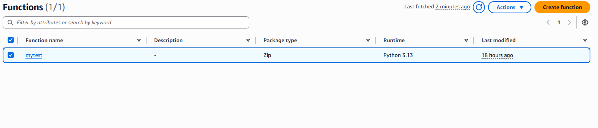
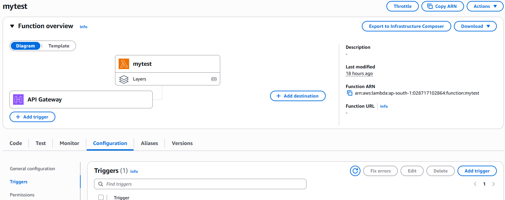
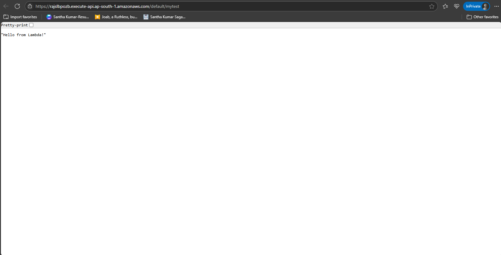

# AWS Lambda + API Gateway Setup

## Overview

This project demonstrates the creation of a simple AWS Lambda function and exposing it through Amazon API Gateway.

---

## Steps Performed

### ✅ Created a Simple Lambda Function

- The Lambda function code is available in:

- Screenshot of the function in AWS Console:

---

### ✅ Created API Gateway

- Used API Gateway to expose the Lambda function via an HTTP endpoint.

- Screenshot of the API Gateway setup:

---

### ✅ Testing and Output

- Invoked the API endpoint to trigger the Lambda function.

- Sample output is shown in the following screenshot:

---

