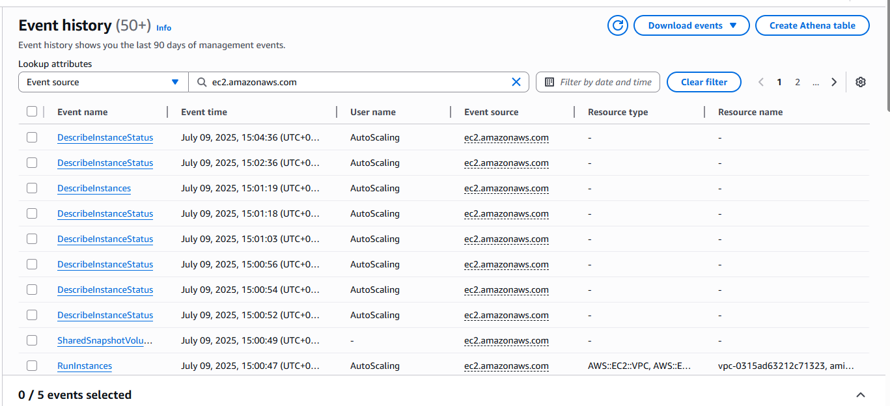
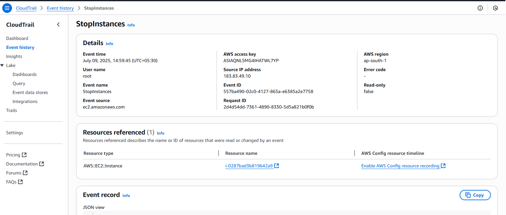

# CloudTrail EC2 Event History

## Viewing EC2 Events in CloudTrail

- CloudTrail is enabled and events are viewed from the **Event history** section in the AWS Console.
- To filter EC2-related events:

  1. Navigate to **Event history** from the left sidebar.
  2. In **Lookup attributes**, use the following filters:
     - **Attribute:** Event Source
     - **Value:** `ec2.amazonaws.com`

- This filter displays only EC2-related events such as `RunInstances`, `TerminateInstances`, etc.

## Screenshots

- **CloudTrail event history with EC2 filter:**

  

- **List of stopped EC2 instances:**

  
