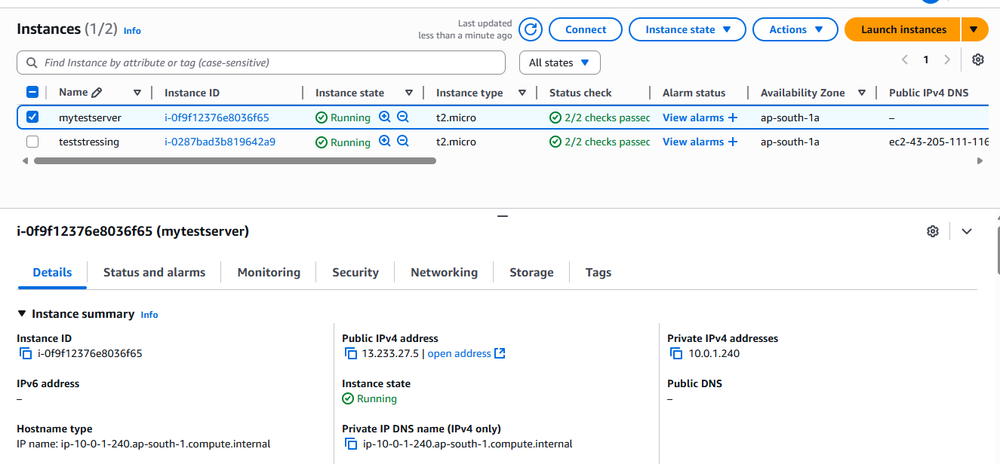
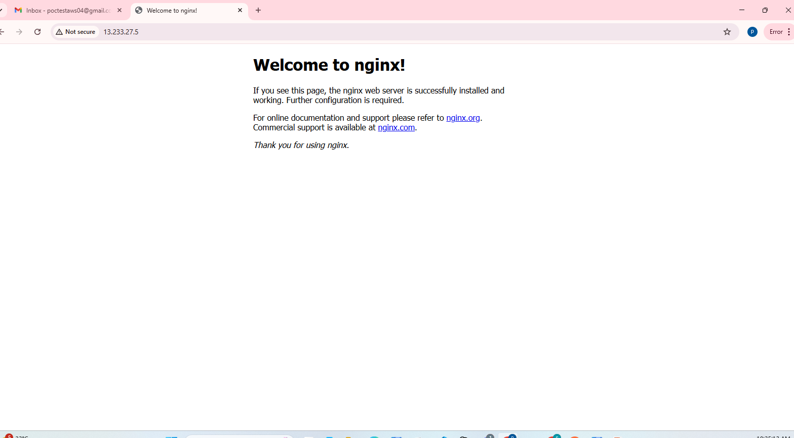

## 🚀 EC2 Instance Setup in Public Subnet

I launched the EC2 instance in the **public subnet**  
with **Ubuntu Linux 24.04** using a `.pem` file.  


Then I connected to the instance using SSH:

```bash
ssh -i <pemfilepath> <username>@<public-ip>
```

After logging in, I executed the following Linux commands:

```bash
# Updating the server with latest features
sudo apt update && sudo apt upgrade -y

# Installing nginx
sudo apt install nginx -y

# Automatically start nginx on system boot
sudo systemctl enable nginx
```

Then I opened **port 80** in the **EC2 Security Group**,  
and I was able to view the **NGINX welcome page** in the browser.  

