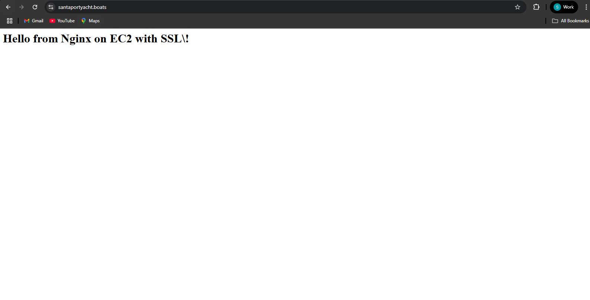
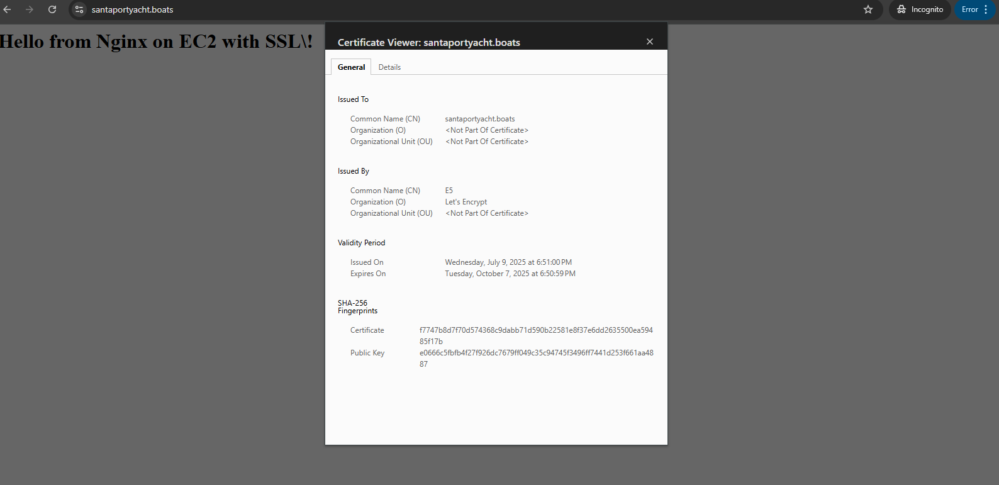

# Hosting a Website with Nginx on EC2 and SSL

This project demonstrates how to host a static website using Nginx on an AWS EC2 instance with a purchased domain and optional SSL.

---

## 🚀 Steps Followed

1. ✅ Launched an **EC2 instance** on AWS.
2. ✅ Purchased a domain from **name.com**.
3. ✅ Configured the domain’s **A record** to point to the EC2 instance’s public IP.
4. ✅ Installed **Nginx** on the EC2 instance.
5. ✅ Uploaded a **sample HTML file** to the instance:
    ```bash
    cd /var/www/santayacht
    ```
6. ✅ Created a site config file in Nginx:
    ```bash
    sudo nano /etc/nginx/sites-enabled/santayacht
    ```
7. ✅ Configured the virtual host and root path in the config file.
8. ✅ Restarted Nginx and verified it works.

---


## 📸 Screenshots

### EC2 and Domain Setup Output


### SSL Configuration Screenshot


---

## ✅ Success

The sample website is now live on the domain with Nginx serving the content from the configured HTML file.

---

