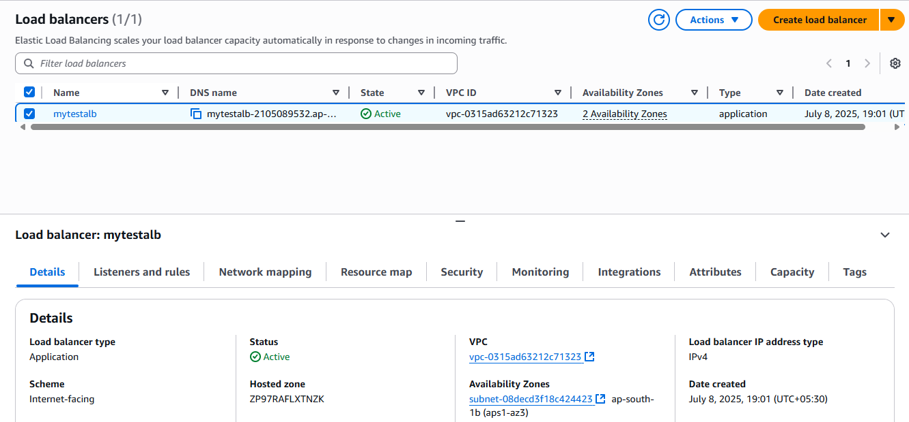
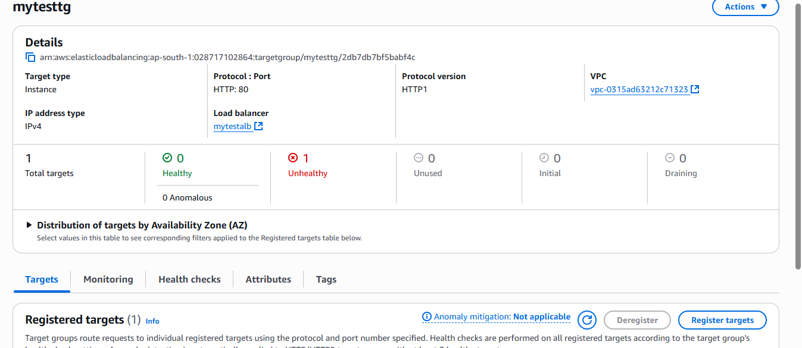

# 🚀 Auto Scaling Demo with ALB and CPU Stress Trigger (AWS Free Tier)

This project demonstrates setting up an **Auto Scaling Group (ASG)** with an **Application Load Balancer (ALB)** and a **Target Group (TG)**, configured to automatically launch EC2 instances based on CPU utilization using the AWS Free Tier.

---

## ✅ Steps Performed

### 1. 🛠️ Launched Auto Scaling Group
- Created a **Launch Template** with a pre-configured EC2 instance (Ubuntu 24 + Nginx).
- Configured an **Auto Scaling Group**:
  - Min: `1`
  - Max: `2`
  - Desired: `1`
- Spread across multiple **Availability Zones** for high availability.

### 2. 🌐 Setup Application Load Balancer
- Created an **Application Load Balancer (ALB)** to distribute incoming traffic.
- Allowed HTTP (port 80) in the ALB's security group.
- Verified DNS hostname of the ALB is accessible.



### 3. 🎯 Created Target Group
- Defined a **Target Group (TG)** with instance targets.
- Configured health checks on port 80 (HTTP).
- Linked the TG to the ALB's listener.



### 4. 🔄 Simulated CPU Load with Stress Tool
- Installed the stress tool on the instance:
  ```bash
  sudo apt update
  sudo apt install stress -y
  stress --cpu 2 --timeout 300
