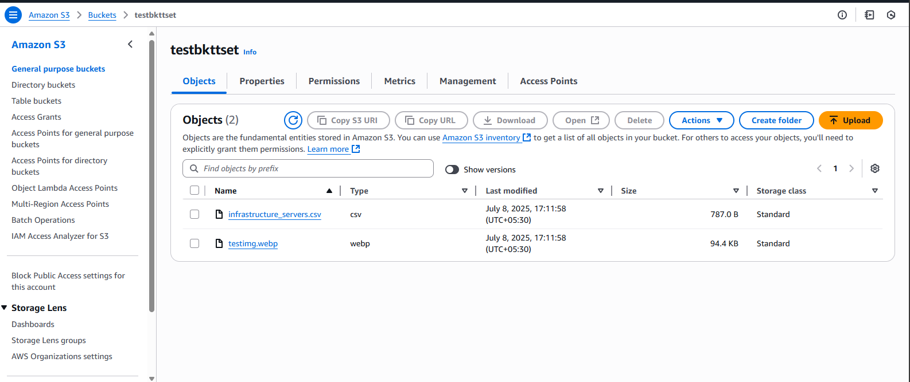

# S3 Bucket Setup

I have created a general purpose S3 bucket with bucket versioning.  


Uploaded some sample files and then attached this bucket policy:

```json
{
    "Version": "2012-10-17",
    "Statement": [
        {
            "Effect": "Allow",
            "Principal": "*",
            "Action": "s3:GetObject",
            "Resource": "arn:aws:s3:::testbkttset/*",
            "Condition": {
                "StringEquals": {
                    "aws:authType": "IAM"
                }
            }
        }
    ]
}
